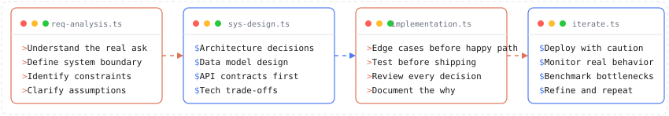

  

  

---

## Sivaprakash — CoreCoderX

Software developer and Computer Science Engineering student building AI applications, LLM infrastructure, backend systems, developer tools, and security tooling. Known on GitHub as [@CoreCoderX](https://github.com/CoreCoderX), working primarily with Java, Spring Boot, TypeScript, React, Python, Node.js, FastAPI, Docker, MySQL, PostgreSQL, Redis and More.

---

## Engineering Lifecycle

  

---

## Tech Stack

  
  
  
  
  
  
  
  

  

---

## Selected Projects

### [ZenXChat](https://github.com/CoreCoderX/ZenXChat)
A multi-LLM chat platform built around provider abstraction and BYOK security. The UI is simple — the engineering underneath isn't. Real-time SSE streaming, model routing, and conversation state.

    

---

### [BankBackendApp](https://github.com/CoreCoderX/BankBackendApp)
Most banking tutorials stop at CRUD. This one doesn't. Multi-factor authentication (OTP, 2FA, TOTP), idempotent UPI transfers, ledger-based accounting, reconciliation jobs, and dispute management — built with Spring Boot to understand how the real thing works internally.

![Java](https://img.shields.io/badge/Java-1C1C1E?style=flat-square&logo=data%3Aimage%2Fsvg%2Bxml%3Bbase64%2CPHN2ZyB4bWxucz0iaHR0cDovL3d3dy53My5vcmcvMjAwMC9zdmciIHdpZHRoPSIyNCIgaGVpZ2h0PSIyNCIgdmlld0JveD0iMCAwIDE4IDI0Ij48cGF0aCBmaWxsPSIjRTA3MzU1IiBkPSJNNS43MDEgMTguNTYxcy0uOTE4LjUzNC42NTMuNzE0Yy41NzUuMDg1IDEuMjM5LjEzNCAxLjkxMy4xMzRjMS4wODQgMCAyLjEzOC0uMTI1IDMuMTQ5LS4zNjNsLS4wOTMuMDE4Yy4zNzQuMjI4LjgwOS40NDUgMS4yNjIuNjI0bC4wNTkuMDJjLTQuNjk4IDIuMDE0LTEwLjYzMy0uMTE3LTYuOTQyLTEuMTQ4em0tLjU3NC0yLjYyOHMtMS4wMjkuNzYyLjU0Mi45MjRhMTkuNDYxIDE5LjQ2MSAwIDAgMCA2LjU0MS0uMzMybC0uMTI5LjAyNGMuMjc1LjI1OC42MDQuNDYzLjk2OC41OTZsLjAyLjAwNmMtNS42OCAxLjY2MS0xMi4wMDguMTMxLTcuOTQyLTEuMjE4em00LjgzOS00LjQ1OGMxLjE1OCAxLjMzMy0uMzA0IDIuNTMyLS4zMDQgMi41MzJzMi45MzktMS41MiAxLjU5LTMuNDE4Yy0xLjI2MS0xLjc3Mi0yLjIyOC0yLjY1MyAzLjAwNi01LjY4OGMwIDAtOC4yMTYgMi4wNTItNC4yOTIgNi41NzR6Ii8%2BPHBhdGggZmlsbD0iI0UwNzM1NSIgZD0iTTE2LjE4IDIwLjUwNXMuNjc4LjU2LS43NDcuOTkyYy0yLjcxMi44MjItMTEuMjg3IDEuMDctMTMuNjcuMDMzYy0uODU2LS4zNzMuNzUtLjg5IDEuMjU0LS45OThjLjIzMi0uMDU5LjQ5OS0uMDkzLjc3NC0uMDkzaC4wNTdoLS4wMDNjLS45NTItLjY3MS02LjE1NSAxLjMxOC0yLjY0IDEuODg2YzkuNTc5IDEuNTU0IDE3LjQ2Mi0uNyAxNC45NzgtMS44MnpNNi4xNDIgMTMuMjFzLTQuMzYyIDEuMDM2LTEuNTQ1IDEuNDEyYTMzLjIyOSAzMy4yMjkgMCAwIDAgNS45MDgtLjA3M2wtLjEzOS4wMTJjMS44MDUtLjE1MiAzLjYxOC0uNDggMy42MTgtLjQ4YTcuNTMzIDcuNTMzIDAgMCAwLTEuMTI2LjYwNWwuMDI5LS4wMThjLTQuNDMgMS4xNjUtMTIuOTg2LjYyMy0xMC41MjMtLjU2OWE4LjE0IDguMTQgMCAwIDEgMy43MzQtLjg5M2guMDQ2aC0uMDAyem03LjgyNCA0LjM3NWM0LjUwMi0yLjM0IDIuNDIxLTQuNTg4Ljk2Ny00LjI4NmEzLjI5OSAzLjI5OSAwIDAgMC0uNTM5LjE0NmwuMDIzLS4wMDdhLjgyMi44MjIgMCAwIDEgLjM3OS0uMjk1bC4wMDYtLjAwMmMyLjg3NC0xLjAxIDUuMDg2IDIuOTgxLS45MjggNC41NmEuMzk1LjM5NSAwIDAgMCAuMDg5LS4xMTVsLjAwMS0uMDAyek0xMS4yNTIgMHMyLjQ5NCAyLjQ5NC0yLjM2NiA2LjMzYy0zLjg5NiAzLjA3Ny0uODg5IDQuODMxIDAgNi44MzZjLTIuMjc0LTIuMDUyLTMuOTQzLTMuODU4LTIuODI0LTUuNTRjMS42NDQtMi40NjggNi4xOTctMy42NjQgNS4xOS03LjYyN3oiLz48cGF0aCBmaWxsPSIjRTA3MzU1IiBkPSJNNi41ODUgMjMuOTI1YzQuMzIuMjc3IDEwLjk2LS4xNTQgMTEuMTItMi4xOThjMCAwLS4zMDIuNzc1LTMuNTcyIDEuMzkxYy0xLjgwNi4zMjYtMy44ODUuNTEyLTYuMDA4LjUxMmMtMS43MzkgMC0zLjQ0OC0uMTI1LTUuMTIxLS4zNjZsLjE5MS4wMjNzLjU1My40NTggMy4zOTMuNjR6Ii8%2BPC9zdmc%2B)      

---

### [Keymontr](https://github.com/CoreCoderX/Keymontr)
Secret detection is easy. False-positive reduction isn't. Keymontr scans source code for exposed credentials using multi-language pattern matching, lockfile exclusions, build output filtering, and structural detection gates.

    

---

### ZenXHub *(Active Development)*
The part of AI applications most people skip: the infrastructure. An offline-first model discovery catalog with stale-while-revalidate caching, provider runtime abstraction, and a CLI/TUI developer interface.

    

---

## How I Think

| Phase | Core Focus | Engineering Mindset |
| :--- | :--- | :--- |
| **01. THINK** | **First Principles** | Don't rush to implement. First ask why it needs to exist. |
| **02. BUILD** | **Pragmatic Simplicity** | Start simple and make it work. Complexity earned is architecture; complexity assumed is tech debt. |
| **03. BREAK** | **Edge-Case Driven** | Edge cases aren't bugs—they are requirements you haven't understood yet. |
| **04. UNDERSTAND** | **Deep Diagnostics** | Read the source code, trace data paths, and challenge abstractions. |
| **05. IMPROVE** | **Feedback Loop** | `BUILD` &nbsp;&rarr;&nbsp; `BREAK` &nbsp;&rarr;&nbsp; `UNDERSTAND` &nbsp;&rarr;&nbsp; `REBUILD` |

> *"Don't just use the system. Understand the system."*

---

## Contribution Graph

  

---

## Connect

  
  &nbsp;
  
  &nbsp;
  
  &nbsp;
  

---

See you in the next commit.

  

