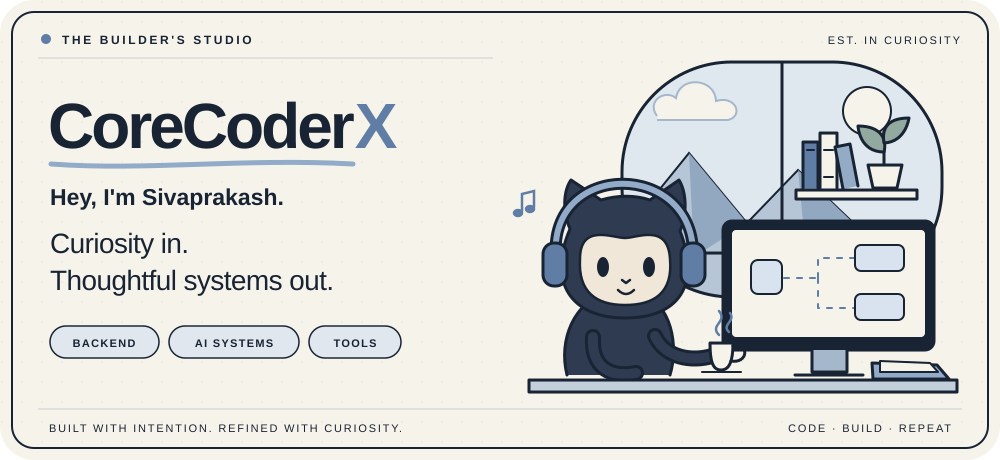
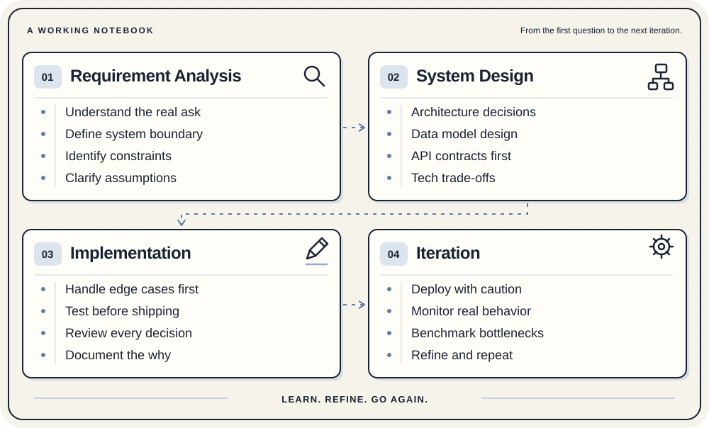
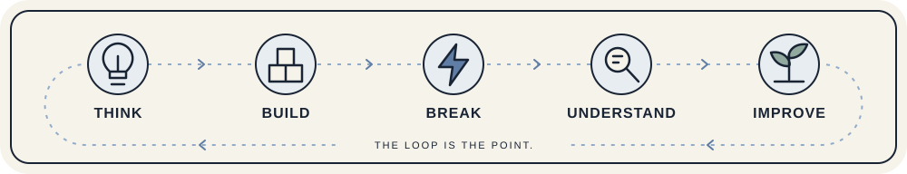
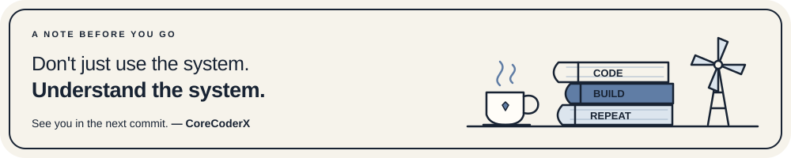

  

## Hey, I'm Sivaprakash.

I'm a software developer known online as [**CoreCoderX**](https://github.com/CoreCoderX). I build backend systems, AI applications and LLM infrastructure, developer tools, and security tooling. I enjoy looking beneath the surface: following the data, questioning the abstractions, and understanding why a system behaves the way it does.

My approach is simple: understand the problem, build with intention, and keep improving what comes next.

## Engineering Lifecycle

A little structure for turning an open question into a working system.

  

The lifecycle, in plain text

| Stage | Checklist |
| :--- | :--- |
| **01 · Requirement Analysis** | Understand the real ask · Define system boundary · Identify constraints · Clarify assumptions |
| **02 · System Design** | Architecture decisions · Data model design · API contracts first · Tech trade-offs |
| **03 · Implementation** | Handle edge cases first · Test before shipping · Review every decision · Document the why |
| **04 · Iteration** | Deploy with caution · Monitor real behavior · Benchmark bottlenecks · Refine and repeat |

## Tech Stack

  
  
  
  
  
  
  
  

  

## Selected Projects

<em>A few systems I built to understand how things actually work.</em>

### [ZenXChat](https://github.com/CoreCoderX/ZenXChat)

**Multi-LLM chat with provider abstraction and BYOK security.**

A multi-LLM chat platform built around provider abstraction and BYOK security. The UI is simple — the engineering underneath isn't. Real-time SSE streaming, model routing, and conversation state.

    

**[→ View on GitHub](https://github.com/CoreCoderX/ZenXChat)**

---

### [BankBackendApp](https://github.com/CoreCoderX/BankBackendApp)

**A banking backend beyond CRUD — MFA, idempotent transfers, ledger accounting.**

Most banking tutorials stop at CRUD. This one doesn't. Multi-factor authentication (OTP, 2FA, TOTP), idempotent UPI transfers, ledger-based accounting, reconciliation jobs, and dispute management — built with Spring Boot to understand how the real thing works internally.

      

**[→ View on GitHub](https://github.com/CoreCoderX/BankBackendApp)**

---

### [Keymontr](https://github.com/CoreCoderX/Keymontr)

**Secret scanning focused on false-positive reduction, not just pattern matching.**

Secret detection is easy. False-positive reduction isn't. Keymontr scans source code for exposed credentials using multi-language pattern matching, lockfile exclusions, build output filtering, and structural detection gates.

    

**[→ View on GitHub](https://github.com/CoreCoderX/Keymontr)**

---

### ZenXHub *(Active Development)*

**Offline-first AI model infrastructure — catalog, cache, and CLI/TUI.**

The part of AI applications most people skip: the infrastructure. An offline-first model discovery catalog with stale-while-revalidate caching, provider runtime abstraction, and a CLI/TUI developer interface.

    

---

## How I Think

  

| Phase | Core Focus | Engineering Mindset |
| :--- | :--- | :--- |
| **01. THINK** | **First Principles** | Don't rush to implement. First ask why it needs to exist. |
| **02. BUILD** | **Pragmatic Simplicity** | Start simple and make it work. Complexity earned is architecture; complexity assumed is tech debt. |
| **03. BREAK** | **Edge-Case Driven** | Edge cases aren't bugs—they are requirements you haven't understood yet. |
| **04. UNDERSTAND** | **Deep Diagnostics** | Read the source code, trace data paths, and challenge abstractions. |
| **05. IMPROVE** | **Feedback Loop** | `BUILD` &nbsp;&rarr;&nbsp; `BREAK` &nbsp;&rarr;&nbsp; `UNDERSTAND` &nbsp;&rarr;&nbsp; `REBUILD` |

> *"Don't just use the system. Understand the system."*

## Contribution Graph

  

## Currently Listening

  

## Let's Connect

  
  &nbsp;
  
  &nbsp;
  
  &nbsp;
  

  

